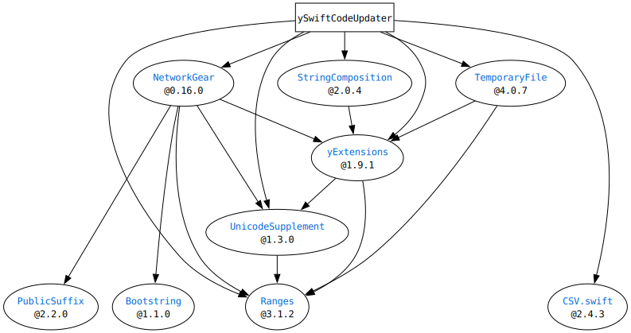

# ySwiftCodeUpdater

This package is just a helper for some of YOCKOW's other packages.

# Requirements

- Swift 5, 6
- macOS(>=10.15) or Linux

## Dependencies

# License
MIT License.  
See "LICENSE.txt" for more information.
