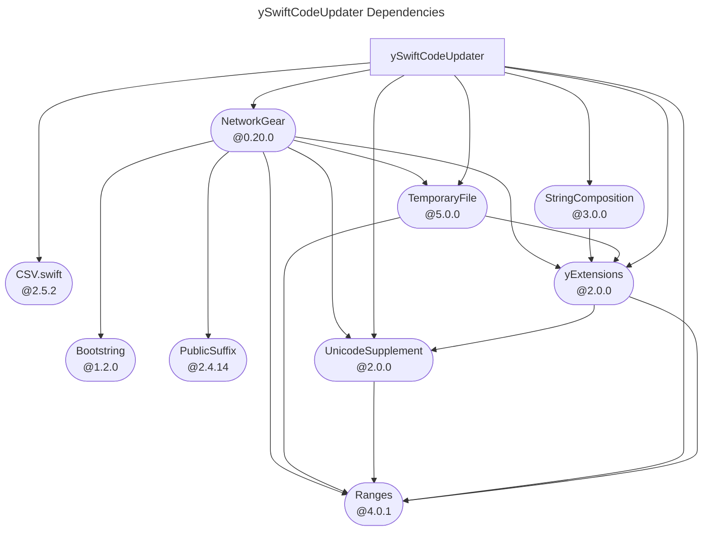

# ySwiftCodeUpdater

This package is just a helper for some of YOCKOW's other packages.

# Requirements

- Swift >=6.2
- macOS(>=13) or Linux

## Dependencies

<!-- SWIFT PACKAGE DEPENDENCIES MERMAID START -->

```mermaid
---
title: ySwiftCodeUpdater Dependencies
---
flowchart TD
  csv.swift(["CSV.swift<br>@2.5.2"])
  swiftbootstring(["Bootstring<br>@1.2.0"])
  swiftnetworkgear(["NetworkGear<br>@0.20.0"])
  swiftpublicsuffix(["PublicSuffix<br>@2.4.14"])
  swiftranges(["Ranges<br>@4.0.1"])
  swiftstringcomposition(["StringComposition<br>@3.0.0"])
  swifttemporaryfile(["TemporaryFile<br>@5.0.0"])
  swiftunicodesupplement(["UnicodeSupplement<br>@2.0.0"])
  yswiftcodeupdater["ySwiftCodeUpdater"]
  yswiftextensions(["yExtensions<br>@2.0.0"])

  click csv.swift href "https://github.com/YOCKOW/CSV.swift.git"
  click swiftbootstring href "https://github.com/YOCKOW/SwiftBootstring.git"
  click swiftnetworkgear href "https://github.com/YOCKOW/SwiftNetworkGear.git"
  click swiftpublicsuffix href "https://github.com/YOCKOW/SwiftPublicSuffix.git"
  click swiftranges href "https://github.com/YOCKOW/SwiftRanges.git"
  click swiftstringcomposition href "https://github.com/YOCKOW/SwiftStringComposition.git"
  click swifttemporaryfile href "https://github.com/YOCKOW/SwiftTemporaryFile.git"
  click swiftunicodesupplement href "https://github.com/YOCKOW/SwiftUnicodeSupplement.git"
  click yswiftextensions href "https://github.com/YOCKOW/ySwiftExtensions.git"

  swiftnetworkgear ----> swiftbootstring
  swiftnetworkgear ----> swiftpublicsuffix
  swiftnetworkgear ----> swiftranges
  swiftnetworkgear --> swifttemporaryfile
  swiftnetworkgear --> swiftunicodesupplement
  swiftnetworkgear --> yswiftextensions
  swiftstringcomposition --> yswiftextensions
  swifttemporaryfile ----> swiftranges
  swifttemporaryfile --> yswiftextensions
  swiftunicodesupplement ----> swiftranges
  yswiftcodeupdater ----> csv.swift
  yswiftcodeupdater --> swiftnetworkgear
  yswiftcodeupdater ----> swiftranges
  yswiftcodeupdater --> swiftstringcomposition
  yswiftcodeupdater --> swifttemporaryfile
  yswiftcodeupdater --> swiftunicodesupplement
  yswiftcodeupdater --> yswiftextensions
  yswiftextensions ----> swiftranges
  yswiftextensions --> swiftunicodesupplement


```
<!-- SWIFT PACKAGE DEPENDENCIES MERMAID END -->

# License

MIT License.  
See "LICENSE.txt" for more information.
